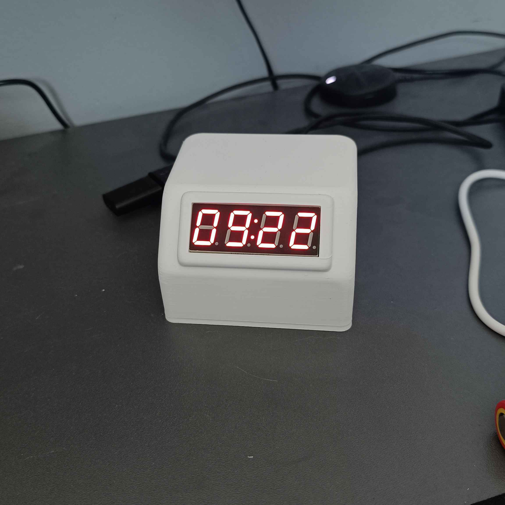
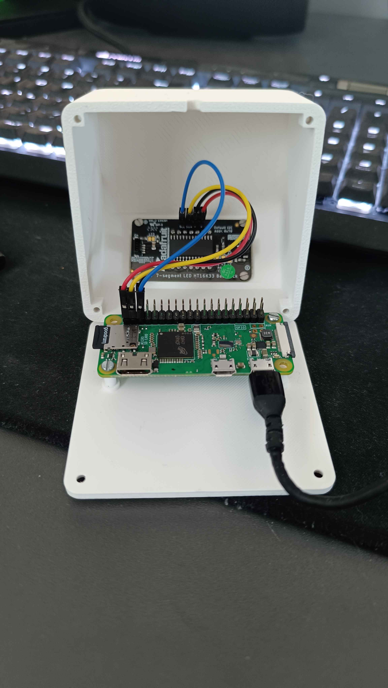

<a id="readme-top"></a>
[![CC BY-NC 4.0][cc-by-nc-shield]][cc-by-nc]
<br />
<div align="center">
 
 <h3 align="center">simple desk clock</h3>

 <p align="center">
 Don't know what to do with your RPi Zero? I got you
 </p>
</div>

***

<br />
<br />

## About the project:
Couple days ago I realised that i have RPi zero laying in the drawer, and also i didn't have much time to start a big project with it. That's why I turned my Zero into a cool desk clock

## What you'll need:
**Circuit Parts:**

* Raspberry Pi Zero *(i used zero w but since every rpi zero has the same hole spacing any zero should work)*
* Adafruit 0.56" 4-Digit 7-Segment Display w/I2C Backpack [[Buy Here]](https://www.adafruit.com/product/879)
* & 4 breadboard female-female cables

**Tools:**

* Any soldering tool *(since display does not come with pre-soldered pins)*
* Screwdriver

**3D Printed Case:**
Download my files with pre loaded settings there: 

**Other stuff:**

* 8x M2,5x8mm screws
* 4x M2x4mm or M2x6mm screws

> [!NOTE]
> If you want to have full advantage of screw/nut hiding spots in case make sure that:
> * Screw head has a height of 1,5mm

## Build Tutorial

Connection here is really simple and only 3 steps are needed to complete it

### 1. Soldering:
Use the **Soldering Tool** to solder pins to the display, make sure that the long side is on the back of the display. You can use breadboard to lock pins in place wich will help you solder it without burning your fingers

### 2. Cables:
On the display you should now have 4 pins named: +, -, SDA, SCL. Connect them to RPi pins as described below:

| Display Pins   | RPi Zero Pins   |
| :--------: | :--------: |
| + | 3.3V Power |
| - | GND |
| SDA | GPIO 2 |
| SCL | GPIO 3|

You can check where those pins are located using that webiste: https://pinout.xyz/

After completing steps above use micro-usb cable to power you RPi, i just connected it to my pc but you can use charger that came with your RPi

### 3. Screws
Now just lock display and RPi inside a case using 4 M2 screws for the display and 4 M2.5 screws for the RPi. It should look like this:



Guide power cable through hole in the top part of the case and use last 4 2.5M screws to close up clock case

## Code

Code for the clock is based on CricuitPython library for this display, to use those libs on regular RPi you'll need to instal **Adafruit Blinka**, full guide on how to do that is provided by adafruit here: [CircuitPython Libraries on Linux and Raspberry Pi](https://learn.adafruit.com/circuitpython-on-raspberrypi-linux/installing-circuitpython-on-raspberry-pi)

Since you now have blinka installed we can go on to the next part of the tutorial

### 1. Base setup

Connect to your RPi via SSH, then create a folder on your RPi, and open it

```sh
mkdir clock
cd clock
```

Open virtual environment and install **ht16k33** library
```sh
source myenv/bin/activate
pip3 install adafruit-circuitpython-ht16k33
```

Create new file for the code
```sh
nano clock.py
```

Paste project code into that file or paste code file `clock.py` into clock directory using SFTP Client
```py
import time
import board
import busio
from adafruit_ht16k33.segments import Seg7x4
from datetime import datetime

# Display setup
i2c = busio.I2C(board.SCL, board.SDA)
display = Seg7x4(i2c)

# Clear display & set brightness
display.fill(0)
display.brightness = 0.2

def get_time():
    datetime_obj = datetime.now()
    formatted_time = datetime_obj.strftime("%H:%M")
    formatted_date = datetime_obj.strftime("%d.%m")
    
    result = {
        "time": formatted_time,
        "date": formatted_date
    }
    
    return result

def display_on_display(time):
    display.print(time)


while True:
    display_on_display(get_time().get('time'))
    time.sleep(1)

```
Use `Ctrl + X` to save file and `Ctrl + C to` exit

After that test the code using `python3 clock.py` command inside the shell

> [!NOTE]
> Clock uses timezone that is set on the RPi, to change it use
> `sudo raspi-config` and go to `Localisation Options` and then `Timezone`

### 2. Setting up service

Now clock won't start by itself after reboot, to change that we will set up **service** that will run out code every time RPi will be rebooted.

Follow steps below:

This command creates service file which contains service configuration
```sh
sudo nano /etc/systemd/system/clock.service
```
Copy this text into that file
```ini
[Unit]
Description=Clock Display Service
After=network.target

[Service]
ExecStart=/home/kame/clock/env/bin/python /home/kame/clock/clock.py
WorkingDirectory=/home/kame/clock
StandardOutput=inherit
StandardError=inherit
Restart=always
User=kame
Environment=PYTHONUNBUFFERED=1

[Install]
WantedBy=multi-user.target

```

Use `Ctrl + X` to save file and `Ctrl + C to` exit

Now reloas systemd:
```sh
sudo systemctl daemon-reload
```
Enable our service
```sh
sudo systemctl enable clock.service
```
Start our service
```sh
sudo systemctl start clock.service
```

Now we can check if there are any errors with this command:
```sh
sudo systemctl status clock.service
```

If code works properly you can close ssh and enjoy your new desk clock 😁


## Afterword
I know that this guide is a mess so if you encounter any problems add me on Discord: `kamehame_ha`
If you liked this project leave a star, I'd appreciate that

### License

This work is licensed under a
[Creative Commons Attribution-NonCommercial 4.0 International License][cc-by-nc].

[![CC BY-NC 4.0][cc-by-nc-image]][cc-by-nc]

[cc-by-nc]: https://creativecommons.org/licenses/by-nc/4.0/
[cc-by-nc-image]: https://licensebuttons.net/l/by-nc/4.0/88x31.png
[cc-by-nc-shield]: https://img.shields.io/badge/License-CC%20BY--NC%204.0-lightgrey.svg

